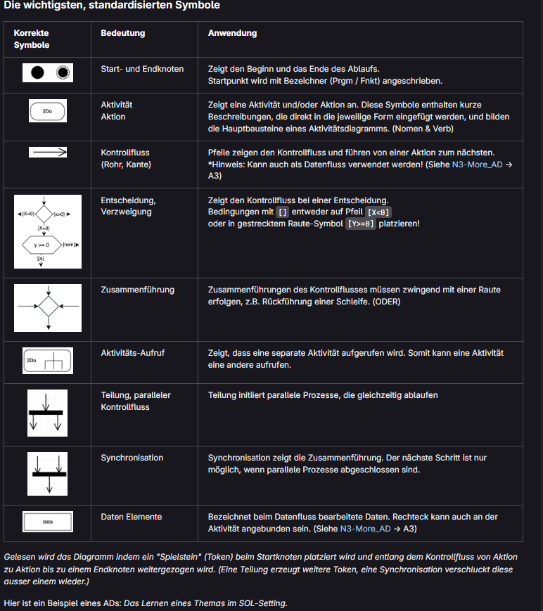
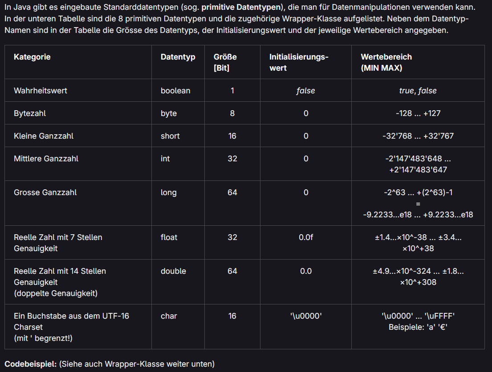
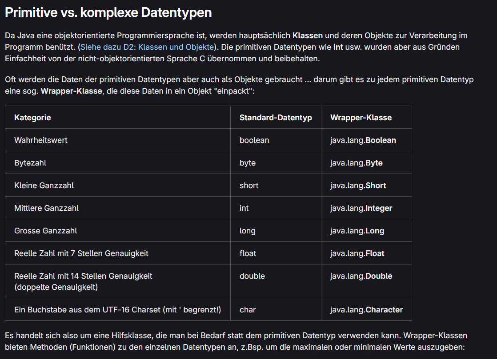

# Dokumentation

## Generelle wichtige Sachen


### Anfang einer Java-Datei

```java
public class Name {

    public static void main(String[] args) {

        // Your code here

    }
}
```

---

### Wie man eine Java-Datei ausführt

```bash
javac Name.java
java Name
```

---

### Beispiel Code für einen Taschenrechner

```java
import java.util.Scanner;

public class rechner {

    public static void main(String[] args) {

        Scanner scanner = new Scanner(System.in);

        System.out.println("=== Taschenrechner ===");

        System.out.print("Erste Zahl: ");
        double zahl1 = scanner.nextDouble();

        System.out.print("Operator (+, -, *, /): ");
        char operator = scanner.next().charAt(0);

        System.out.print("Zweite Zahl: ");
        double zahl2 = scanner.nextDouble();

        double ergebnis;

        switch (operator) {
            case '+':
                ergebnis = zahl1 + zahl2;
                break;

            case '-':
                ergebnis = zahl1 - zahl2;
                break;

            case '*':
                ergebnis = zahl1 * zahl2;
                break;

            case '/':
                if (zahl2 != 0) {
                    ergebnis = zahl1 / zahl2;
                } else {
                    System.out.println("Fehler: Division durch 0!");
                    return;
                }
                break;

            default:
                System.out.println("Ungültiger Operator!");
                return;
        }

        System.out.println("Ergebnis: " + ergebnis);

        scanner.close();
    }
}
```

---

## Aufträge

### UML Activity Diagramm

**Hier werden die Strukturen eines UML's erklärt.**



---

### Variables Constants

**Hier ein Bild, das Datentypen erklärt.**



**Und hier ein passender Beispiel-Code:**
```java
	System.out.println("Double min: " + Double.MIN_VALUE);        
	System.out.println("Double max: " + Double.MAX_VALUE);        
	System.out.println("Float  min: " + Float.MIN_VALUE);        
	System.out.println("Float  max: " + Float.MAX_VALUE);
```

**Wie man Variablen definiert:**

```java
double preis = 120;   // Deklaration UND Initialisation
preis = preis * 1.11; // Veränderung des Inhaltes
```

**Wie man Constans definiert:**

```java
final char CONST_C = ‘c’;
```

**Primitive vs. komplexe Datentypen**




